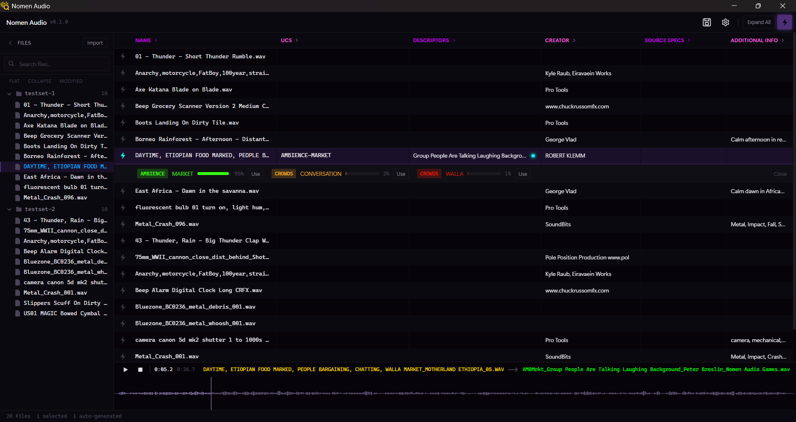

<p align="center">
  
</p>

# Nomen Audio

Windows desktop tool for sound designers to rename and re-tag audio assets to [UCS](https://universalcategorysystem.com/) (Universal Category System) standard.

## What It Does

Professional audio libraries often differ in metadata and naming convention across different libraries and projects. As a sound designer working with many audio libraries, this means that finding the right sounds can be very time consuming and tedious, especially if assets are poorly named or if certain metadata simply doesn't exist. The [Universal Category System (UCS)](https://universalcategorysystem.com/) helps solve this issue, but applying it to existing libraries is a very manual, file-by-file process.

Nomen Audio addresses this issue by providing an automated way to standardize audio assets to the UCS convention. The application imports audio assets (`.wav`) and their embedded metadata (iXML, BEXT, RIFF INFO chunks), and a machine learning backed pipeline infers each file's UCS category, subcategory, and description. Addiitonal matadata fields are also generated, and the user may review every suggestion, edit fields freely in-place, or write additional metadata tags. Nothing touches disk until the user explicitly saves - the assets are then atomically renamed and metadata written. See [`pipeline.md`](pipeline.md) for more details.

## Features

| Manual Workflow                                            | ML Pipeline                                                       |
| ---------------------------------------------------------- | ----------------------------------------------------------------- |
| Import any folder of WAV files                             | MS-CLAP zero-shot classification → top-N UCS category suggestions |
| Spreadsheet editor — 20+ columns, inline editing           | ClapCap natural-language description generation                   |
| UCS cascading dropdowns (753 subcategories, 49 categories) | SSE streaming batch analysis with per-file progress               |
| iXML / BEXT / RIFF INFO round-trip read + write            | All suggestions are proposals — nothing written until user saves  |
| Waveform player (wavesurfer.js)                            | Confidence-ranked suggestions with one-click accept               |
| File tree sidebar with search                              |                                                                   |
| Batch save / revert / find & replace                       |                                                                   |
| Atomic rename: original untouched on error                 |                                                                   |



_Spreadsheet-style editor with an expandable column layout. The left sidebar shows an imported file tree across two test folders. The selected file — an Ethiopian food market ambience recording — has been analysed: UCS category `AMBIENCE › MARKET`, CatID `AMBMrkt`, and FX Name "Group People Are Talking Background" are all auto-populated, with colour-coded badges indicating generated fields. The bottom strip shows the waveform player mid-playback, with the old filename on the left and the proposed UCS-standard rename on the right._

## Installation

**System requirements:** Windows 10 or 11 (64-bit), 8 GB RAM (16 GB recommended), ~4 GB free disk space. No Python, Node.js, or Rust required — everything is bundled.

### Step 1 — Download

Go to the [Releases](https://github.com/peterbreslin/nomen-audio/releases) page and download one of:

| Installer                   | Format | Notes                                                       |
| --------------------------- | ------ | ----------------------------------------------------------- |
| `Nomen Audio_x64-setup.exe` | NSIS   | Recommended for most users — guided wizard with uninstaller |
| `Nomen Audio_x64_en-US.msi` | MSI    | IT/enterprise deployment, Group Policy                      |

### Step 2 — Run the installer

Double-click the downloaded file. If Windows shows a **"Windows protected your PC"** SmartScreen warning, click **More info → Run anyway**. This appears because the app is not yet code-signed — it is not a virus alert.

Accept the UAC prompt and follow the installer wizard. Default path: `C:\Program Files\Nomen Audio\`.

### Step 3 — First launch

The app opens immediately. On first launch:

- The Python backend starts in the background (takes a few seconds — normal).
- The status bar shows **"Loading models…"** — ML models load in the background. The app is fully usable as a manual metadata editor while this happens.

### Step 4 — ML model download

Model weights are **not bundled** in the installer and download automatically on first use:

| Model                          | Size    | When                                                     |
| ------------------------------ | ------- | -------------------------------------------------------- |
| MS-CLAP 2023 (classifier)      | ~660 MB | Background, on every first launch                        |
| ClapCap + GPT-2 (descriptions) | ~2.1 GB | On first click of **Generate** with descriptions enabled |

**Total on first full use: ~2.8 GB.** Subsequent launches use cached weights — no download.

Weights are stored in the standard Hugging Face cache at `%USERPROFILE%\.cache\huggingface\hub\`.

> For full troubleshooting steps (antivirus, proxy, slow first analysis), see [`docs/installation.md`](docs/installation.md).

## Development Setup

### Prerequisites

- [Git](https://git-scm.com/)
- [uv](https://docs.astral.sh/uv/) (Python package manager)
- [Node.js](https://nodejs.org/) ≥ 20
- [Rust stable](https://rustup.rs/) + `cargo`
- [Visual Studio Build Tools](https://visualstudio.microsoft.com/visual-cpp-build-tools/) (C++ workload, required by Tauri)

### Steps

```pwsh
git clone https://github.com/your-org/nomen-audio.git
cd nomen-audio

# Python backend
uv sync

# Frontend
cd frontend
npm install
```

> **UCS data**: The `data/UCS/` directory (committed in repo) must contain the UCS 8.2.1 spreadsheet, downloaded free from [universalcategorysystem.com](https://universalcategorysystem.com/). Place the `.xlsx` file at `data/UCS/UCS Master List V8.2.1.xlsx`.

### Run in Dev Mode

```pwsh
cd frontend
npm run tauri dev
```

This starts the Vite dev server, spawns the Python sidecar, and opens the Tauri window with hot-reload.

## Running Tests

```pwsh
# Python backend
uv run pytest -q

# Frontend (Vitest)
cd frontend && npm run test
```

## Building for Production

```pwsh
pwsh -NoProfile -File scripts/build.ps1
```

The script runs tests → lint → PyInstaller sidecar → Tauri installer and prints the output path on completion. Installers land in:

```
frontend/src-tauri/target/release/bundle/msi/
frontend/src-tauri/target/release/bundle/nsis/
```

See [`scripts/README.md`](scripts/README.md) for details on individual build scripts.

## Project Structure

```
nomen-audio/
├── src/                  # Python FastAPI sidecar (business logic, I/O, ML)
│   └── app/              # Main package — routers, services, db, ml, ucs, metadata
├── frontend/             # Tauri + Svelte 5 application
│   ├── src/              # Svelte components, stores, TypeScript
│   └── src-tauri/        # Rust shell, Tauri config, sidecar binaries
├── data/                 # UCS spreadsheets
├── docs/                 # User-facing documentation
├── scripts/              # PowerShell build automation
├── tests/                # Python pytest suite
```

## Tech Stack

| Layer                | Technology                                                                                       |
| -------------------- | ------------------------------------------------------------------------------------------------ |
| Desktop shell        | [Tauri v2](https://tauri.app/) (Rust)                                                            |
| Frontend             | [Svelte 5](https://svelte.dev/) + TypeScript, Tailwind CSS, shadcn-svelte                        |
| Waveform             | [wavesurfer.js](https://wavesurfer.xyz/)                                                         |
| HTTP transport       | `@tauri-apps/plugin-http` (Rust reqwest, bypasses WebView2 networking)                           |
| Python runtime       | Python 3.12, [uv](https://docs.astral.sh/uv/), [FastAPI](https://fastapi.tiangolo.com/), uvicorn |
| Database             | SQLite (via `sqlite3` stdlib)                                                                    |
| Audio classification | [MS-CLAP](https://github.com/microsoft/CLAP) (zero-shot, CPU-only)                               |
| Captioning           | [ClapCap](https://github.com/prompteus/clapgrep) (audio → natural-language description)          |
| WAV I/O              | Custom RIFF writer (atomic, chunk-preserving) + [wavinfo](https://github.com/iluvcapra/wavinfo)  |

## Architecture

The frontend is a pure display layer — it never reads or writes files directly. All file I/O, metadata parsing, UCS lookups, and ML inference run inside the Python sidecar process. On startup the sidecar binds to a random localhost port, prints `PORT=<n>` to stdout, and Tauri reads that port to construct request URLs. HTTP/JSON over `127.0.0.1` is the only IPC channel. This keeps the Rust layer thin and makes the backend independently testable. See [`pipeline.md`](pipeline.md) for more details.
